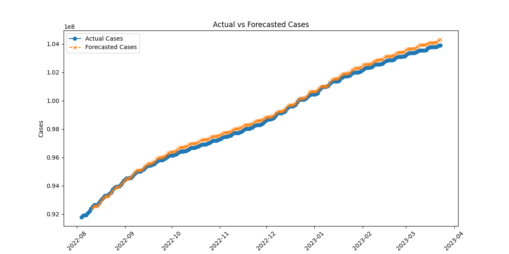

Time Series Forecasting with ARIMA

This project demonstrates how to perform time series forecasting using the ARIMA (AutoRegressive Integrated Moving Average) model in Python. The dataset utilized contains historical case counts over time, and the goal is to predict future case numbers based on past trends.

## Table of Contents

- [Introduction](#introduction)
- [Dataset](#dataset)
- [Prerequisites](#prerequisites)
- [Project Structure](#project-structure)
- [Usage](#usage)
- [Results](#results)
- [Contributing](#contributing)
- [License](#license)

## Introduction

Time series forecasting is a crucial aspect of data analysis, enabling the prediction of future data points based on historical patterns. The ARIMA model is a popular statistical method used for this purpose, particularly when the data shows evidence of non-stationarity. This project showcases the application of the ARIMA model to forecast case counts and evaluates the model's performance using the Mean Absolute Percentage Error (MAPE).

## Dataset

The dataset used in this project is stored in a CSV file named `us.csv`. It contains two columns:

- `date`: The date of the recorded cases.
- `cases`: The number of cases recorded on the corresponding date.

Ensure that this CSV file is located in the same directory as the Python script or adjust the file path accordingly.

## Prerequisites

To run the code, you need the following Python libraries installed:

- `pandas`
- `numpy`
- `matplotlib`
- `statsmodels`
- `scikit-learn`

You can install these dependencies using `pip`:

```bash
pip install pandas numpy matplotlib statsmodels scikit-learn
```


## Project Structure

The project consists of a single Python script that performs the following steps:

1. **Data Loading**: Reads the dataset from the CSV file.
2. **Data Preprocessing**:
   - Converts the 'date' column to datetime format and sets it as the index.
   - Ensures the 'cases' column is numeric and drops any NaN values.
3. **Data Splitting**: Divides the data into training (80%) and testing (20%) sets.
4. **Differencing**: Applies 7-day differencing to remove trends and achieve stationarity.
5. **ARIMA Order Selection**: Performs a grid search to determine the optimal (p, d, q) parameters based on the Akaike Information Criterion (AIC).
6. **Model Fitting**: Fits the ARIMA model using the optimal parameters.
7. **Forecasting**: Generates forecasts for the test period.
8. **Evaluation**: Calculates the Mean Absolute Percentage Error (MAPE) to assess model accuracy.
9. **Visualization**: Plots the actual vs. forecasted cases for visual comparison.

## Usage

To run the forecasting model, execute the Python script. Ensure that the `us.csv` dataset is in the correct location or update the file path in the script accordingly. The script will output the MAPE for both the training and testing sets and display a plot comparing actual and forecasted cases.

## Results

The ARIMA model achieved a Mean Absolute Percentage Error (MAPE) of 4.4% on the test set, indicating a high level of forecasting accuracy. Below is the plot comparing the actual and forecasted case counts:



*Figure: Actual vs. Forecasted Cases*

## Contributing

Contributions to enhance this project are welcome. Feel free to fork the repository and submit pull requests with improvements or additional features.

## License

This project is licensed under the MIT License. See the [LICENSE](LICENSE) file for details.

